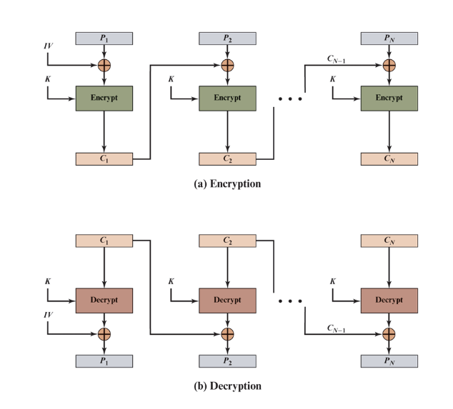
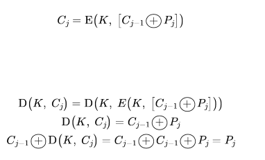
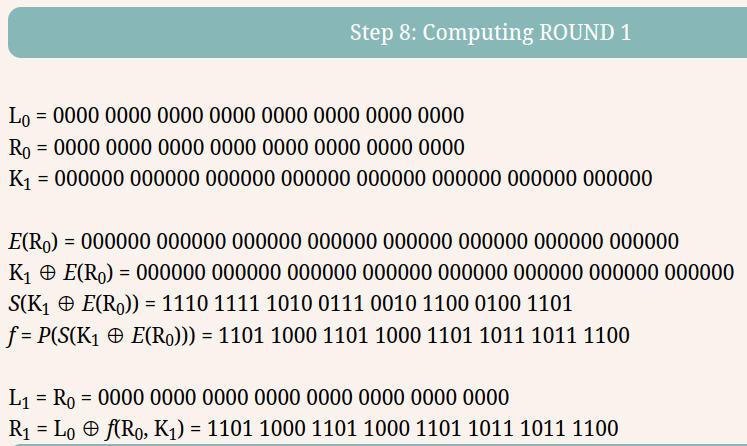
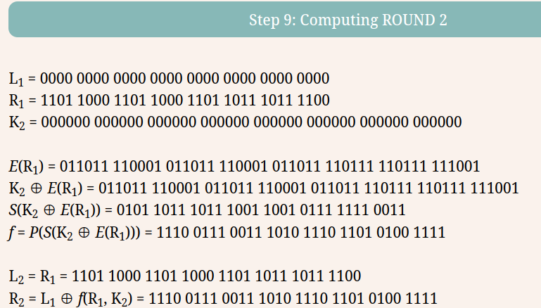
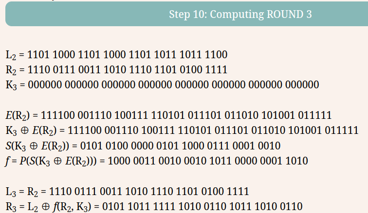
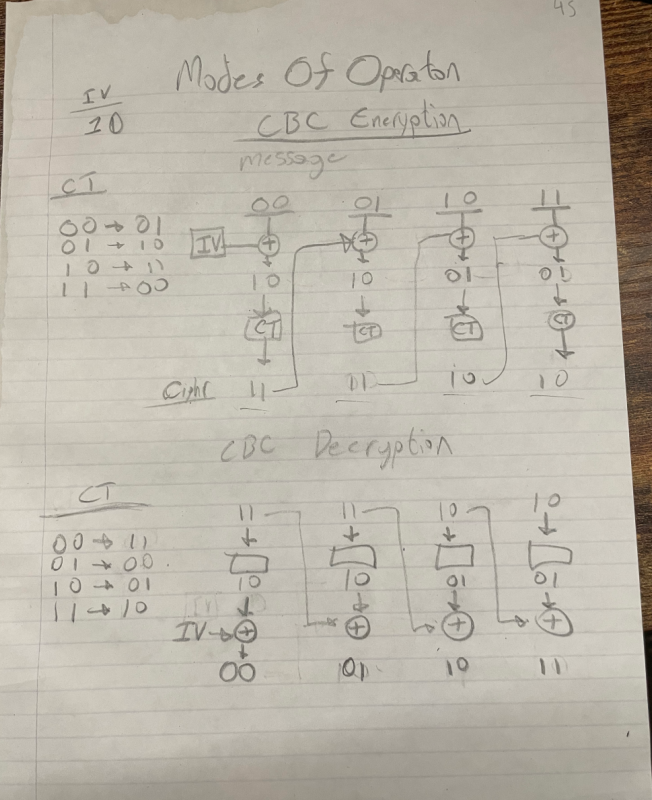
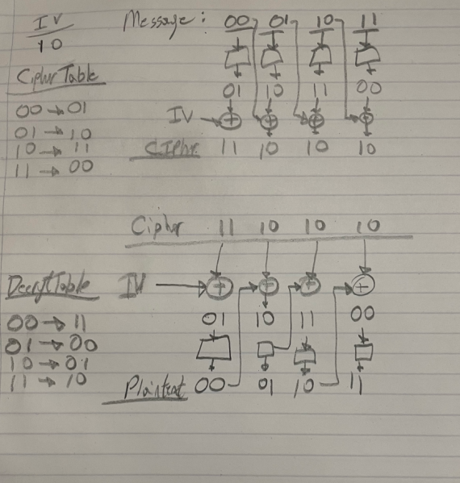
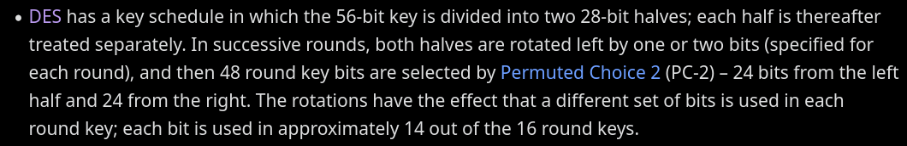

# ECE 571 | Cryptography and Network Security | Homework 2

Name: Alan Manuel Loreto Cornídez

Due Date: February 19th, 2024

# Stinson's Book

## 2.3

- Prove that the Affine Cipher achieves perfect secrecy if every key is used
  with equal probability $\frac{1}{312}$.

Let 
$$P = P = \mathbb{Z}_{26}$$ 
and let 
$$K = \{(a, b) \in \mathbb{Z}_{26} \times \mathbb{Z}_{26}: gcd(a, 26) = 1\}$$

For $K = (a,b) \in K$, define:

$$e_{k}(x) = (ax + b) \mod(26)$$

and 
$$d_{k}(y) = a^{-1}(y - b) \mod(26) \text{for} x, y \in \mathbb{Z}_{26}$$

There are 312 possible keys 26 times 12 possible co-prime values $\mod26$: 
$$12 \times 36 = 312$$

Let us pick one kay and one encryption. All possibilities for the ciphertext can be expressed in the following equation:

$$Pr[y] = \sum\limits_{k\in K} Pr[k] Pr[d_{k}(y)] = \frac{12}{312}Pr[a] + ... + \frac{12}{312}Pr[z] = \frac{1}{26}(Pr[a] + ... + Pr[z]) = \frac{1}{26}$$

Using Bayes' theorem, we can express the following:

$$Pr[x|y] = \frac{Pr[x]Pr[x|y]}{Pr[y]} = \frac{Pr[x] \frac{1}{26}}{\frac{1}{26}} = Pr[x]$$

Thus, proving the perfect secrecy of the affine cipher.

- More generally, suppose we are given a probability distribution on the set $\{  a \in \mathbb{Z}_{26} : \text{gcd}(a, 26) = 1\}$. Suppose that every key  $(a,b)$ for the Affine Cipher is used with probability $Pr[a]/26$. Prove that the Affine Cipher achieves perfect secrecy when this probability distribution is defined on the keyspace.

Let  (P, K, C, E, D) provide perfect secrecy. Then accoding to this theorem, $\forall x \in P, y \in C$, there exists a key $K$ such that $e_{k}(x) = y$, and we can write the inequalities

$$|C| = |\{e_{K}:K \in K\}| \le |K|$$

But by assumption$|C| = |K|$ and hence, the above inequality holds an equality. 

$$|C| = |\{e_{K}:K \in K\}| = |K|$$

Thus, there does not exist two difference keys such that $e_{K_{1}}(x) = e_{K_{2}} = y$, and for any $x \in P$, there exists a unique key $K$ such that $e_{K}(x) = y$.

Using Bayes' theorem (again) 

$$Pr[x_{i}|y] = \frac{Pr[y|x_{i}] Pr[x_{i}]}{Pr[y]}= \frac{Pr[K K_{i}]Pr[x_{i}]}{Pr[y]}$$

Thus, $Pr[K_{i}] = Pr[y], 1 \le i \le n$. This is equivalent to $$Pr[K] = \frac{1}{|K|}, \forall K \in K$$

## 2.13

- Consider a cryptosystem in which $\mathbb{P} = \{a, b, c\}$, $\mathbb{K} = \{K_{1}, K_{2}, K_{3}\}$, and $\mathbb{C} = \{1, 2, 3, 4\}$. Suppose the encryption matrix is as follows:

$$
\begin{matrix} && a && b && c \\ K_{1} && 1 && 2 && 3 \\ K_{2} && 2 && 3 && 4
\\ K_{3} && 3 && 4 && 1 \\ \end{matrix}
$$

Given that the keys are chosen equiprobably, and the plain-text probability distribution is $Pr[a] = \frac{1}{2}$ $Pr[b] = \frac{1}{3}$ $Pr[c] = \frac{1}{6}$

Does this cryptosystem have perfect secrecy?

A cryptosystem has perfect secrecy if $Pr[p = x|c = y] = Pr[p = x].$

Given the probability distributions of P and K, we can compute the probability distributions of C as follows:

$$Pr[1] = \frac{1}{2}\cdot\frac{1}{3\ }+\frac{1}{6}\cdot\frac{1}{3} = \frac{2}{9}$$
$$ Pr[2] = \frac{1}{3}\cdot\frac{1}{3}+\frac{1}{2}\cdot\frac{1}{3} = \frac{5}{18}$$
$$ Pr[3] = \frac{1}{3}\cdot\frac{1}{3}+\frac{1}{2}\cdot\frac{1}{3}+\frac{1}{6}\cdot\frac{1}{3}= \frac{1}{3}$$
$$ Pr[4] = \frac{1}{6}\cdot\frac{1}{3}+\frac{1}{3}\cdot\frac{1}{3} = \frac{1}{6}$$

We can now compute the probability for the plain-text $x \in P$ given that a specific cipher-text was observed.

$$Pr[a|1] =  \frac{Pr[a] \cdot Pr[1|a]}{Pr[1]}  =\frac{\frac{1}{2} \cdot \frac{1}{3}}{\frac{2}{9}} = \frac{3}{4}$$

Since, $Pr[a] = \frac{1}{2}\ne Pr[a|1] =\frac{3}{4}$  this cryptosystem is not perfectly secret.

# Textbook Questions

## 4.5

- For any block cipher, the fact that it is a nonlinear function is crucial to its security. To see this, suppose that we have a linear block cipher EL that encrypts 128-bit blocks of plaintext into 128-bit blocks of ciphertext. Let $EL(k, m)$ denote the encryption of a 128-bit message $m$ under a key $k$ (the actual bit length of is irrelevant). Thus, $$EL(k, [m_{1} \oplus m_{2}]) = EL((k, m_{1}) \oplus EL(k, m_{2})$$ for all 128-bit patterns $m_{1}, m_{2}$.

Describe how, with 128 chosen cipher-texts, an adversary can decrypt any cipher-text without knowledge of the secret key $k$ (A "chosen cipher-text" means that an adversary has the ability to choose a cipher-ext and then obtain its decryption. Hey, you have 128 plain-text/cipher-text pairs to work with and you have the ability to choose the value of the cipher-texts.)

For $1 \le i \le 128$, take $c_{i}\{0, 1\}^{128}$ to be the string containing a 1 in position $i$ and then zeros elsewhere. Obtain the decryption of these 128 ciphertexts. $\{m_{1}, m_{2}, ..., m_{128}\}$ are the corresponding ciphertexts. Given any ciphertext that does not consist of all zeros, there is a unique nonempty subset of the $c_{i}$'s which we can XOR together to obtain $c$. Let $I(c) \subseteq \{1, 2, ..., 128\}$ denote this subset.

$$c = \mathop{\oplus}_{\substack{i \in I(c)}} c_{i} = \mathop{\oplus}_{\substack{i \in I(c)}} E(m_{i}) = E(\mathop{\oplus}_{\substack{i \in I(c)}} m_{i})$$

Thus, we obtain the plain-text of $c$ by computing $\mathop{\oplus}_{\substack{i \in I(c)}} m_{i}$. We can decrypt every message from the cipher-text $c \in \{0, 1\}^{128}$ using the method:

$$E(0) =  E(0 \oplus 0)= E(0) \oplus E(0) = 0:  c = 0 \rightarrow m = 0$$

## 6.6
Compare AES to DES. For each of the following elements of DES, indicate the comparable element in AES or explain why it is not needed in AES.

- XOR of sub-key material with the input to the f function: **The addround key is the comparable element, with the IV and key.**
- XOR of the f function output with the left half of the block: **The mixcolumn step, because this is where the different bytes interact with each other.**
- f function:** Bytesub step, this is where elements are non-linearly modified.**
- permutation P: **The shiftrow step, this step permutates the bytes.**
- swapping of halves of the block: **There is no need to swap blocks because the mixcolumn and shiftrow blocks each permutate the blocks.** 

## 7.4

With the ECB mode, if there is an error in a block of the
transmitted cipher-text, only the corresponding plain-text block is
affected. However, in the CBC mode, this error propagates. For
example, an error in the transmitted $C_{1}$ obviously corrupts $P_{1}$ and $P_{2}$. 

- Are any blocks beyond affected? 

No, the ourput $P_{3}$ only depends on $C_{2}$ and $C_{3}$. 

- Suppose that there is a bit error in the source version of $P_{1}$. Through how many cipher-text blocks is this error propagated? What is the effect at the receiver?

An error in $P_{1}$ affects $C_{1}$. In addition, since $C_1$ is an input to the calculation of $C_{2}$, $C_{2}$ is also affected. This effect carries out through all of the blocks, so the entire message is affected. However, at the receiving end, the decryption algorithm restores the correct plain-text for blocks except the one in error. 

This is because the decryption uses the erroneous cipher in both the decryption and encryption steps, so the error is cancelled in all but the initially corrupted block.

# Attached Questions

## 1 | Moore's Law

- If the useful life of DES was about 20 years (1977-1999), how long do you predict the useful life of AES (128-bits key) to be? Justify your answer. (Hint: you may need to consider the Moore’s Law (Google it) in order to answer this problem.)

According to the information given in class regarding the growth of computer speeds using Moore's law: Key's must grow by about 1 bit every two years.

This means that if the AES protocol uses 128 bits, the useful life if this protocol will be 
$$128 - y/2 = 0$$

$$y = 256 \text{ years}$$

However, DES uses 64 bits, and that took twenty years to become obsolete. Using this as our starting point, we can estimate the useful life-time of AES-128 to be:

20 years + years needed to crack an additional 64 bits 

$$20 + 128 = 148 \text{ years}$$

## 2 | Inverse Keys

- What is the output of the first round of DES when the plaintext and the key are both all zeros? What if the plaintext and the key are all ones? (Complete details of each DES round can be found in the textbook appendix S, or [here](http://page.math.tu-berlin.de/~kant/teaching/hess/krypto-ws2006/des.htm).

If the key used in the DES algorithm is all zeros or the key's are inverses of themselves are all zeros, then the security of the the algorithm is compromised. 

One of these cases is when the  key is all zeros. This causes the encryption process to not actually encrypt the plain-text for the first block. This is because the encryption process uses an XOR operation. XORing with an all zero vector returns the same number and the non-zero input. However, it  is even worse if the plain-text is all zeros because this would reveal the key to the attacker. 

In addition, the use of an all-zero key is is that an all zero key is an inverse of itself, meaning that the 

## 3 | S-Box XOR

An important property which makes DES secure is that the S-boxes are nonlinear. Verify the nonlinearity of the S-boxes by computing the output of box S1, for three pairs of inputs. Then show that:

$$S_{1}(x_{1}) \oplus S_{2}(x_{2}) \neq S_{1}(x_{1} \oplus x_{2})$$

for the pairs of three numbers: 

a. $x_{1} = 000000$, $x_{2} = 000001$
b. $x_{1} = 111111$, $x_{2} = 100000$
c. $x_{1} = 101010$, $x_{2} = 010101$

The first S-Box is shown below:

**Note: assuming the first and last bits are used for the left column since the S-box states input is bits 1 and six as follows: ** $\{123456\}_{2}$

a. $x_{1} = 000000$, $x_{2} = 000001$
The first operation:

$$S(x_{1} \oplus x_{2}) = S(000000 \oplus 000001) = S(000001) = 0000$$

Now, the second operation:

$$S(x{1}) \oplus S(x_{2}) = S(000000) \oplus S(000001) = 1110 \oplus 0000 = 1110$$

They do not equal each other.

b. $x_{1} = 111111$, $x_{2} = 100000$

The  first operation:

$$S(x_{1} \oplus x_{2}) = S(111111 \oplus 100000) = S(011111) = 1000$$

Now, the second operation:

$$S(x{1}) \oplus S(x_{2}) = S(111111) \oplus S(100000) = 1101 \oplus 0100 = 1001$$

They are not the same.

c. $x_{1} = 101010$, $x_{2} = 010101$

The  first operation:

$$S(x_{1} \oplus x_{2}) = S(101010 \oplus 010101) = S(111111) = 1101$$

Now, the second operation:

$$S(x{1}) \oplus S(x_{2}) = S(101010) \oplus S(010101) = 1001 \oplus 1111 = 0110$$

They are not the same.

## 4 | 

- Assume that bit 57 of a 64 plaintext block is 1 with all other bits equal to zero. Let the key be all zeros.

a. How many S-boxes get different inputs compared to the case of an all-zero plaintext, in the first round of DES?

Only one S-Box gets different inputs compared to all zero plaintext due to the lack of a feedback element. 

b. What is the number of output bits which are different compared to the input after the first round?

Only one output bit is different between an all zero plain-text and bit flipped 57 (in this case, bit 9)

c. How many output bits have actually changed after the first round compared to the case of an all-zero plain-text (consider only one round). Does DES exhibit the avalanche effect (small changes in the plain-text yield significant changes in the ciphertext)?

Only one output bit changes when using an all zero plaintext. However, DES does exhibit an avalanche effect as more rounds are used (up to a point of diminishing returns, in this case, ~16 rounds)

Do not forget to apply the initial permutation on the plaintext before passing it through the DES round.

Images used from : [a DES calculator online](https://simewu.com/des/)

## 5 | Modified CBC Mode

Consider the following alternative method of encrypting a message. To encrypt a message, use the algorithm for doing a CBC decrypt. To decrypt a message, use the algorithm for doing a CBC encrypt. Would this work? What are the security implications of this, if any, as contrasted with the “normal” CBC?

The modified CBC method will properly cipher and decipher the text. In addition, there are no extra security concerns due to the symmetrical nature of the cipher block chaining mode. 

Here is an example of the CBC normal mode:

And here is the same message en/decrypted using the modified CBC mode:

As you can see, both of the methods render the same plaintext/cipher text combo.

## Extra Credit Problem | 6

Find keys $K$ such that:

$$\text{DES}_{K}(\text{DES}_{K}(x)) = x, \forall x$$

Such a key is sometimes called a “weak” key. How many weak keys can you find? To solve this problem you need to look up the exact key schedule generation algorithm for DES. For details refer to [this site](http://page.math.tu-berlin.de/~kant/teaching/hess/krypto-ws2006/des.htm). (Show your work or you will receive zero credit!)

We can look up information regardin gthe key schedule for DES:

This set of keys are weak because the 56 bit key i broken up into 16 subkeys when running the DES key schedule. One key is used in each round. The weak keys produce the same subkeys for all 16 rounds, thus, it is like.
Weak Keys:
- 0x0101010101010101
- 0xFEFEFEFEFEFEFEFE: 
- 0xE0E0E0E0F1F1F1F1
- 0x1F1F1F1F0E0E0E0E

Not Considering parity bits alsp causes the keys to be weak:
- 0x0000000000000000
- 0xFFFFFFFFFFFFFFFF
- 0xE1E1E1E1F0F0F0F0
- 0x1E1E1E1E0F0F0F0F
