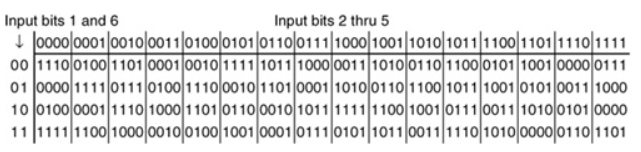

# ECE 571 | Cryptography and Network Security | Homework 1

Name: Alan Manuel Loreto Cornídez

Due Date: February 19th, 2024

# Stinson's Book

## 2.3

<!-- TODO -->

- Prove that the Affine Cipher achieves perfect secrecy if every key is used
  with equal probability $\frac{1}{312}$.

- More generally, suppose we are given a probability distribution on the set $\{
  a \in \mathbb{Z}_{26} : \text{gcd}(a, 26) = 1\}$. Suppose that every key
  $(a,b)$ for the Affine Cipher is used with probability $Pr[a]/26$. Prove that
  the Affine Cipher achieves perfect secrecy when this probability distribution
  is defined on the keyspace.

## 2.13

<!-- TODO -->

- Consider a cruptosystem in which $\mathbb{P} = \{a, v, c\}$, $\mathbb{K} = \{
  K_{1}, K_{2}, K_{3}\}$, and $\mathbb{C} = \{1, 2, 3, 4\}$. Suppose the
  encryption matrix is as follows:

$$
\begin{matrix} && a && b && c \\ K_{1} && 1 && 2 && 3 \\ K_{2} && 2 && 3 && 4
\\ K_{3} && 3 && 4 && 1 \\ \end{matrix}
$$

Given that the keys are cosen equiprobably, and the plaintext probability
distribution is $Pr[a] = 1/2$ $Pr[b] = 1/3$ $Pr[c] = 1/6$

Does this cryptosystem have perfect secrecy?

# Textbook Questions

## 4.5

<!-- TODO -->

## 6.6

<!-- TODO -->

## 7.4

<!-- TODO -->

# Attached Questions

## 1

- If the useful life of DES was about 20 years (1977-1999), how long do you
  predict the useful life of AES (128-bits key) to be? Justify your answer.
  (Hint: you may need to consider the Moore’s Law (Google it) in order to answer
  this problem.)

<!-- TODO -->

## 2

- What is the output of the first round of DES when the plaintext and the key
  are both all zeros? What if the plaintext and the key are all ones? (Complete
  details of each DES round can be found in the textbook appendix S, or
  [here](http://page.math.tu-berlin.de/~kant/teaching/hess/krypto-ws2006/des.htm).

<!-- TODO -->

## 3

An important property which makes DES secure is that the S-boxes are nonlinear.
Verify the nonlinearity of the S-boxes by computing the output of box S1, for
three pairs of inputs. Then show that:

$$S_{1}(x_{1}) \oplus S_{2}(x_{2}) \neq S_{1}(x_{1} \oplus x_{2})$$

for

a. $x_{1} = 000000$, $x_{2} = 000001$

b. $x_{1} = 111111$, $x_{2} = 100000$

a. $x_{1} = 101010$, $x_{2} = 010101$

The first S-Box is shown below:

<!-- TODO -->

## 4

- Assume that bit 57 of a 64 plaintext block is 1 with all other bits equal to
  zero. Let the key be all zeros.

a. How many S-boxes get different inputs compared to the case of an all-zero
plaintext, in the first round of DES?

b. What is the number of output bits which are different compared to the input
after the first round?

c. How many output bits have actually changed after the first round compared to
the case of an all-zero plaintext (consider only one round). Does DES exhibit
the avalanche effect (small changes in the plaintext yield significant changes
in the ciphertext)?

Do not forget to apply the initial permutation on the plaintext before passing
it through the DES round.

<!-- TODO -->

## 5

Consider the following alternative method of encrypting a message. To encrypt a
message, use the algorithm for doing a CBC decrypt. To decrypt a message, use
the algorithm for doing a CBC encrypt. Would this work? What are the security
implications of this, if any, as contrasted with the “normal” CBC?

<!-- TODO -->

## Extra Credit Problem | 6

Find keys $K$ such that:

$$\text{DES}_{K}(\text{DES}_{K}(x)) = x, \forall x$$

Such a key is sometimes called a “weak” key. How many weak keys can you find? To
solve this problem you need to look up the exact key schedule generation
algorithm for DES. For details refer to
[this site](http://page.math.tu-berlin.de/~kant/teaching/hess/krypto-ws2006/des.htm).
(Show your work or you will receive zero credit!)
