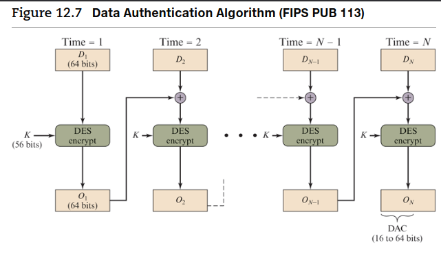
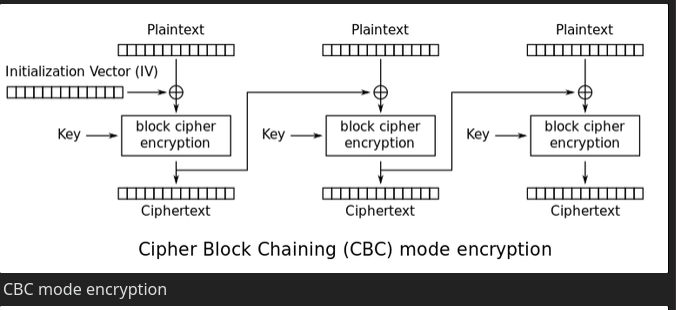
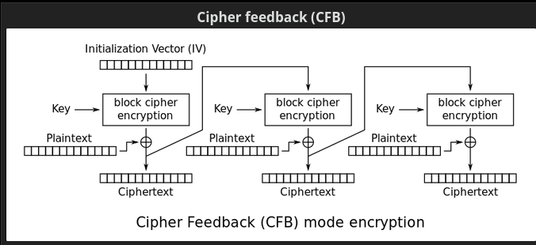
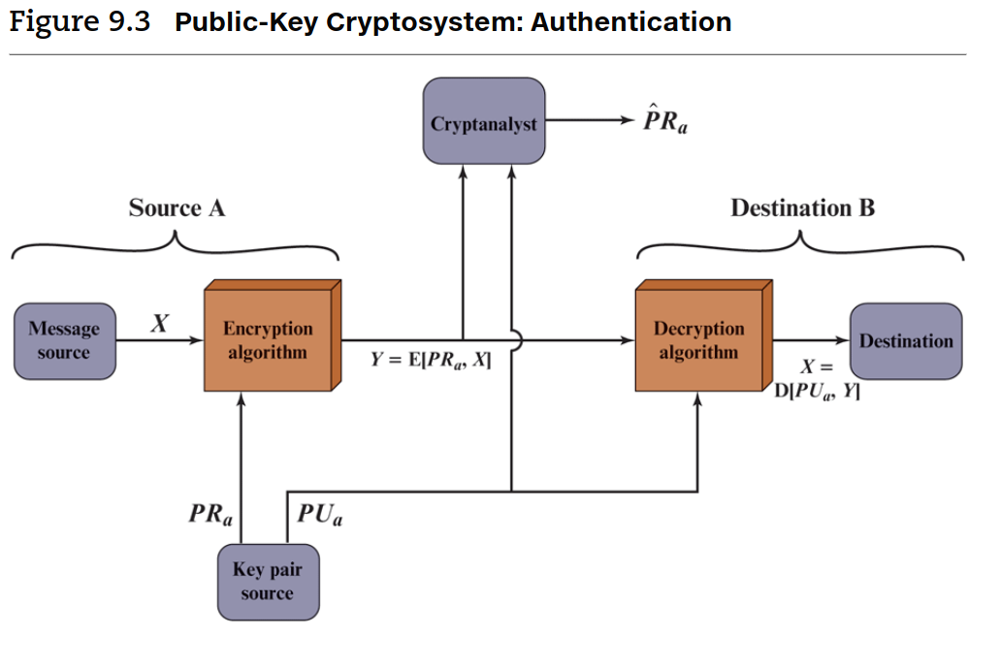
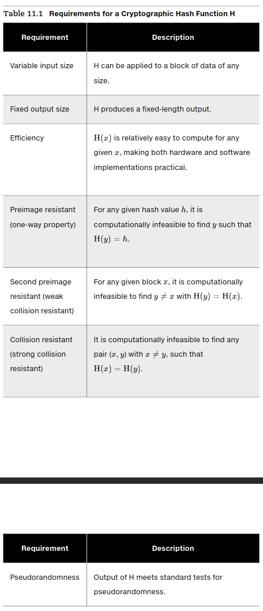
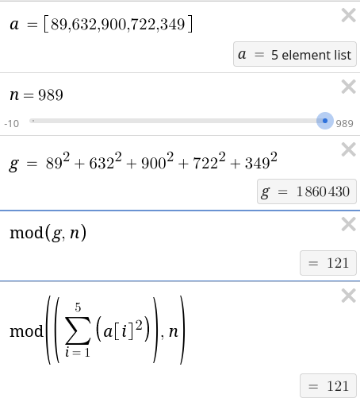
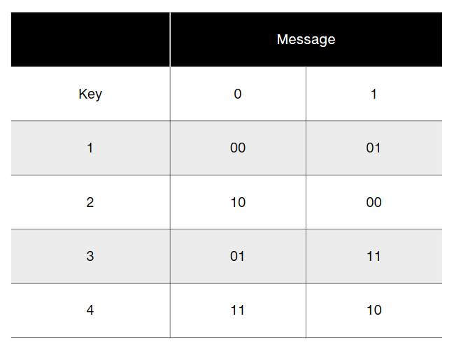

# ECE 570 | Cryptography and Network Security | Homework 3

Name: Alan Manuel Loreto Cornídez

Due Date: February 19th, 2024

## Problem 12.2 

The data authentication algorithm, described in Section 12.6 , can be defined as using the cipher block chaining (CBC) mode of operation of DES with an initialization vector of zero (Figure12.7). Show that the same result can be produced using the cipher feedback mode.

### Answer

In order to achieve the same output as the CBC mode of operation in DES using the CFB mode you need to set the initialization vector to zero, this allows the cipher to behave similarly to the CBC mode. 

## Problem 12.3 

At the beginning of Section 12.6, it was noted that given the CBC MAC of a one-block message $X$, say $T = MAC(K, X)$,  the adversary immediately knows the CBC MAC for the two-block message $X||(X \oplus T)$ since this is once again $T$. Justify this statement. 

### Answer
For a single block: $$T = E (K, X)$$

And for two blocks:  $$E(k, (T \oplus (x \oplus T))) = E(k, x) = T$$

Therefore, the adversary knows the CBC MAC for the two block message if the CBC MAC is given for the one-block message.

## Problem 13.8

An early proposal for a digital signature scheme using symmetric
encryption is based on the following. To sign an $n$-bit  message,
the sender randomly generates in advance $2n$ 56-bit cryptographic keys:

$$k1, K1, k2, K2,  ..., kn, Kn$$

which are kept private. The sender prepares in advance two sets
of corresponding non-secret 64-bit validation parameters, which
are made public:

$$u1, U1, u2, U2, ..., un, Un \text{ and }, v1, V1, v2, V2, ..., vn, Vn$$

where

$$vi = E(ki, ui), Vi = E(Ki, Ui)$$

The message $M$ is signed as follows. For the $i$th bit of the
message, either $ki$ or $Ki$ is attached to the message, depending on
whether the message bit is 0 or 1. For example, if the first three
bits of the message are 011, then the first three keys of the signature are $k1, K2, K3$

1. How does the receiver validate the message?
2. Is the technique secure? 
3. How many times can the same set of secret keys be safely used for different messages?
4. What, if any, practical problems does this scheme present?

### Answer

1. The receiver requires the keys used to sign the message in order to validate the received message using the system encryption parameters.
2. The technique is only secure if we can assume the encryption process is secure. However, this technique is vulnerable to a known plain-text attack.
3. Secret keys can be used $n$ times assuming $2n$ signatures. If an attacker has access to $n$ signed messages, then cracking the keys is not (relatively) computationally expensive at that point.
4. The number of keys that are required for this system is quite large since new keys need to be generated as soon as they are used, not to mention, the keys need to be sent over the network (or communication medium) as well.

## Problem 4 

The following two sub problems involve Fermat’s Theorem (same as problems 2.20 and 2.22 from the textbook).

1. Using Fermat's Theorem, find $3^{201}\mod 11$
2. Using Fermat's Theorem, find a number $x$ between $0$ and $28$ with $x^{85}$ congruent to $6 \mod 29$. You should not use any brute force searching).

### Answer

#### Part 1 

$$a^{p-1} \equiv a \mod p$$

$$3^{201} \mod 11 = 3 \times 3^{10 \times 20} = 3 \times 1 \mod 11 = 3$$

#### Part 2

$$x = [0,28]$$

$$x^{85} \equiv 6 \mod 29$$

$$a^{p} \equiv a \mod p$$

$$a = 6, p = 29$$

$$6 \times 6^{28 \times 3} \equiv 6 \mod 29$$

$$x = 6$$

## Problem 5

The following two sub problems involve Euler’s Theorem (same as problems 2.23 and 2.24 from the textbook). 

1. Using Euler’s Theorem, find a number a between 0 and 9 such that a is congruent to $7^{1000}\mod 10$. (note: this is the same as the last digit of the decimal expansion of $7^{1000}$)
2. Using Euler’s Theorem, find a number $x$ between $0$ and $28$ with congruent to $6 \mod 35$. (you should not use any brute-force searching)

### Answer 

#### Part 1 

$$a^{\phi(n)} \equiv 1 \mod n$$

$$n = 10, a = 7, \phi(10) = 4$$

$$7^{4 * 250} \equiv 1 \mod 10$$

$$\therefore 1$$

#### Part 2

$$x^{85} \equiv 6 \mod 35$$

$$n = 35, a = 6, \phi(35) = 24$$

$$6^{24 \times 3} \times 6^{13}\equiv 1 \mod 35$$

$$6^{13}\mod 35 = 6$$

$$\therefore 6$$

## Problem 6

Suppose Fred sees your RSA signature on $m_{1}$ and on $m_{2}$ (i.e. he sees $m_{1}^{d}\mod n$ and $m_{2}^{d}\mod n$). How does he compute the signature on each of these messages: $m_{1}^{j}\mod n$ (for positive integer $j$), $m_{1}^{-1} \mod n$, $m_{1} \times m_{2} \mod n$, and in general $m_{1}^{j}\times m_{2}^{k}$ (for arbitrary integers $j$ and $k$)?

### Answer

$$m_{1}^{d} \mod n$$

$$m^{2}\mod n$$

$$(m_{1}^{d})^{j} \mod n = (m_{1}^{j})^{d} \mod n$$

Fred calculates the multiplicative inverse

$$(m_{1}^{d})^{(-1)}\mod n$$

Then Fred can calculate $m_{1}$ and $m_{2}$.

$$(m_{1}\times m_{2})^{d}\mod n = ((m_{1}^{d}\mod n) \times (m_{2}^{d} \mod n))\mod n$$

## Problem 7

Suppose Alice and Bob know each other's public key. Alice sends a message to Bob.
How can she encrypt the message so that, when Bob receives it, he is sure about all of the following? 

1. Nobody else can view the content (confidentiality),
2. The message is from Alice and no one has modified it (authentication, integrity).
3. Nobody else (Eve) could trick Bob into thinking that Eve also generated the same message.

### Answer 

Alice can encrypt the message using Bob's key, then Alice presents her public key as a signature. Bob can then decrypt the message using his private key and ensure that the public key matches Alice's key. If the public keys are tampered with, then the senders will be know. i.e. Bob will know if Eve has tampered with the message. 

## Problem 9.18

This problem illustrates a simple application of the chosen ciphertext attack. Bob intercepts a ciphertext $C$ intended for Alice and encrypted with Alice’s public key . Bob wants to obtain the original message $M = C^{d}\mod n$. Bob chooses a random value $r$ less than $n$ and computes

$$Z = r^{e}\mod n$$
$$X = ZC\mod n$$
$$t = r^{-1}\mod n$$

Next, Bob gets Alice to authenticate (sign) $X$ with her private key (as in Figure 9.3 ), thereby decrypting $X$. Alice returns $Y = X^{d}\mod n$. Show how Bob can use the information now available to him to determine $M$.

### Answer

Recall, the intercepted message is: 

$$M = C^{d}\mod n$$

Bob can use the returned message from Alice (which is the message that was intercepted and encrypted with Bob's values):

$$Y = X^{d}\mod n$$

and encrypt it with the multiplicative inverse of his random value:

$$t = r^{-1}\mod n$$

Thus, giving the following state:

$$tY \mod n = r^{-1}X^{d}\mod n$$

Since $Z = r^{e}\mod n$ then $r = Z^{d}\mod n$, thus, we can calculate the original message, $C^{d}\mod n$.

$$r^{-1}X^{d}\mod n = r^{-1}Z^{d}C^{d}\mod n = C^{d}\mod n = M$$

## Problem 11.3

   
   
   
1. Consider the following hash function. Messages are in the form of a sequence of numbers in $Z_{n,}M = (a_{1}, a_{2}, ..., a_{t})$. The hash value $h$ is calculated as $(\sum\limits_{i=1}^{t} a_{i})$ for some predefined value $n$. Does this hash function satisfy any of the requirements for a hash function listed in Table 11.1 ? Explain your answer.
2. Repeat part (a) for the hash function $h = (\sum\limits_{i=1}^{t}(a_{i})^{2})\mod n$
3. Calculate the hash function of part (b) for $M = (189, 632, 900, 722, 349)$ and $n =989$

### Answer

#### Part A 

Variable Input Size: Yes, this hash function can have inputs of multiple sizes

Fixed Output Size: No, the hash function does not output to a fixed output size. A larger input size (both in number of terms and magnitude of the inputs) will make the output of the hash function grow.

Efficiency: The hash function has a time complexity of $O(n)$ because there is a running sum of all of the terms in the input. This is relatively simple.

Preimage Resistant (One-Way Property): No, this propery does not work. $y = 1, H(1) = 1$

Second Preimage Resistant (Weak Collision Resistant): No, this property is not present: $x = \{1, 3\}, y = \{2, 2\}, H(x) = 4, H(y) = 4$

Collision Resistant (Strong Collision Resistant): No, since the function is not Second Pre-image Resistant.

#### Part B

Variable Input Size: Yes, the input can be of arbitrary length.

Fixed Output Size: Yes, different inputs can all be limited to the same size because of the $\mod n$. The size of the output is $n$

Efficiency: This is a relatively simple algorithm, however, efficiency depends on software and the ability to calculate squared numbers.

Pre-image Resistant (One-Way Property): This is true for inputs that are not equal to one. Assuming this condition, we can say that this hash function satisfies the one-way property. If the inputs are at least as larger as $\sqrt {n}$, this is also true.

Second Pre-image Resistant (Weak Collision Resistant): This depends on the $n$ that is used to modulo the input. However, for $n = 10$, we can calculate $y = \{2, 3\}, H(y) = 3, x =\{8, 7\}, H(x) = 3$, so in this case, the hash function is not Weak collision resistant.

Collision Resistant (Strong Collision Resistant): No, since the hash function is not weak collision resistant, the hash function is not Strong collision resistant.

#### Part C

$$M = (189, 632, 900, 722, 349)$$

$$H(M) = 121$$

## Problem 12.9

*Hint: for 11.3 (b), you can use the quadratic residue problem: https://en.wikipedia.org/wiki/Quadratic_residuosity_problem*

Alice wants to send a single bit of information (a yes or a no) to
Bob by means of a word of length 2. Alice and Bob have four
possible keys available to perform message authentication. The
following matrix shows the 2-bit word sent for each message
under each key:

1. The preceding matrix is in a useful form for Alice. Construct a matrix with the same information that would be more useful for Bob.
2. What is the probability that someone else can successfully impersonate Alice?
3. What is the probability that someone can replace an intercepted message with another message successfully?

### Answer

#### Part A

The table for bob would look something like this:

|         | Key |     |     |     |
| ------- | --- | --- | --- | --- |
| Message | 1   | 2   | 3   | 4   |
| 0       | 00  | 10  | 01  | 11  |
| 1       | 01  | 00  | 11  | 10  |

This table makes it easier for bob to decipher the message if knows what key the message is encrypted with.

Another way to play the same data is by arranging the table by ciphertext and message and them populate the cells with the key:

|        |     | Message |     |
| ------ | --- | ------- | --- |
|        |     | 0       | 1   |
| Cipher | 00  | 1       | 2   |
|        | 01  | 3       | 1   |
|        | 10  | 2       | 4   |
|        | 11  | 4       | 2   |

#### Part B 

We can see that there are 4 keys, and only two possible plain-text messages. This means that there are 8 total real mappings into the cipher text.

However, there are 16 total possible mappings from plaintext to ciphertext (2 bits \* 4 keys = 16).

Assuming the impersonator knows the system being used, they can randomly send messages and send a real possible message 50\% of the time. Since there are 8 real mappings and 16 possible mappings. 

$$\frac{8}{16} = 50\%$$

However, this encryption scheme is vulnerable to a chosen plain-text attack similar to the one in problem 9.8

#### Part C

When using a chosen plain-text attack the probability that the impersonator can successfully intercept and replace the message successfully reaches 100\% as long as the impersonator has time to analyze the scheme. However, if only one attempt is possible, then the probability is only 50\% and is lower if the impersonator wants to send a specific message. In the case that the attacker wants to send the opposite of the actual message, the probability becomes 25\%.=

