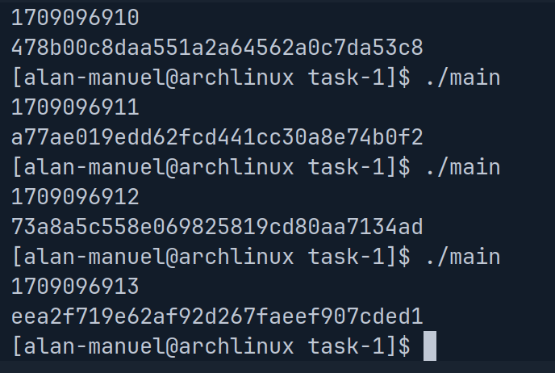
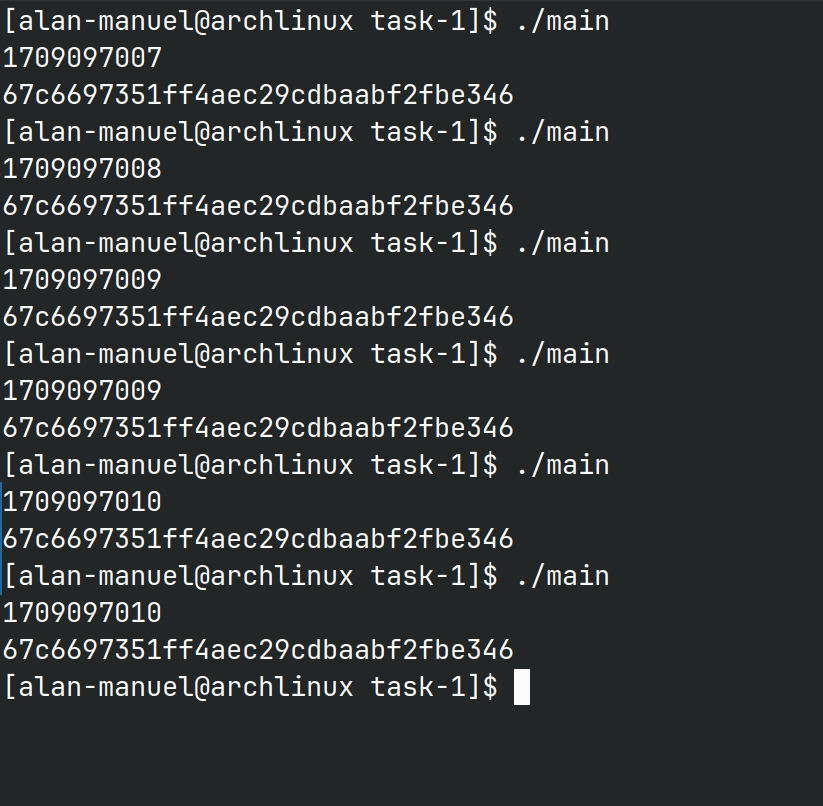
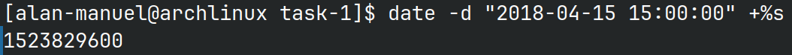
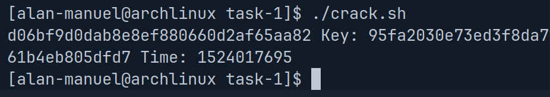
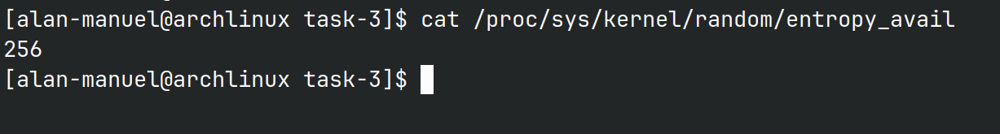
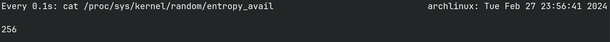
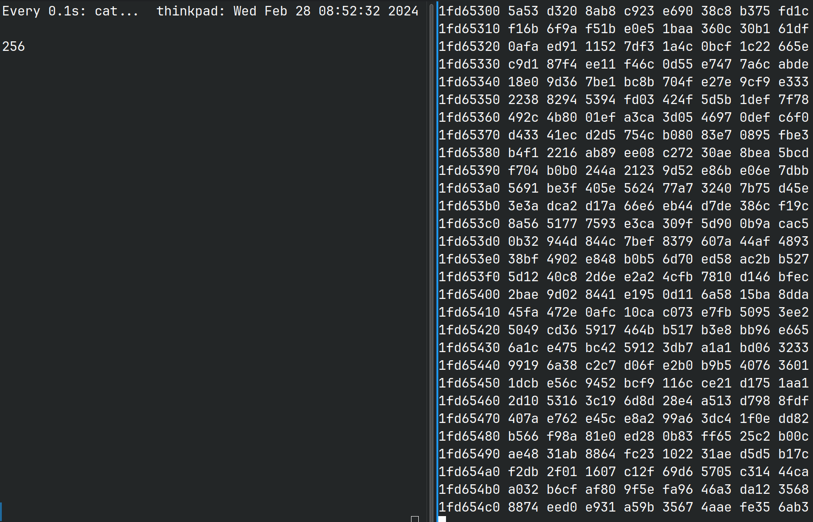
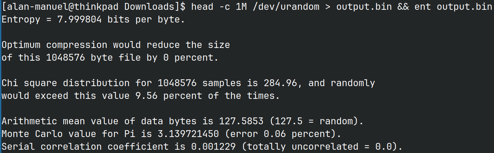
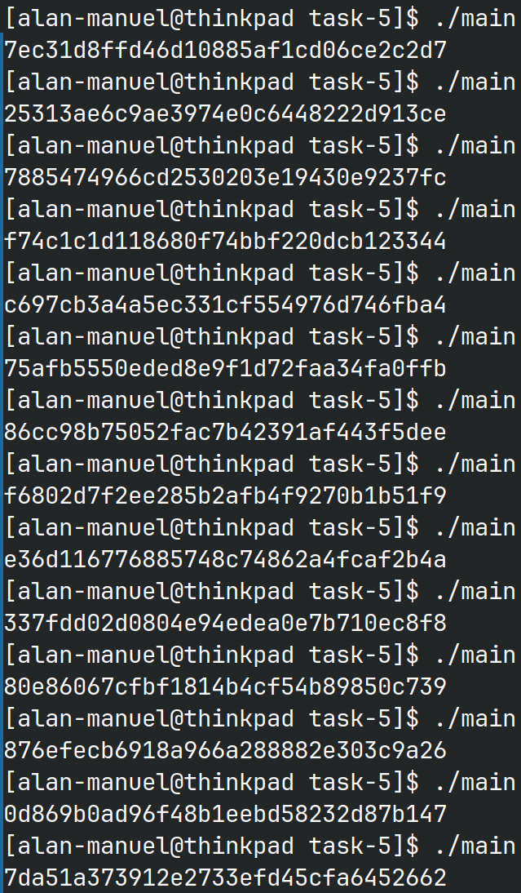

# Fundamentals of Cryptography and Network Security | Lab 2

Name: Alan Manuel Loreto Cornídez
Date: 02/28/2024
Course: ECE 571

## Task 1 | Generate Encryption Key in a Wrong Way

I created the following code:

```c
#include <stdio.h>
#include <stdlib.h>
#include <time.h>

#define KEYSIZE 16

int main() {
  int i;
  char key[KEYSIZE];

  printf("%lld\n", (long long)time(NULL));

  srand(time(NULL));

  for (i = 0; i < KEYSIZE; i++) {
    key[i] = rand() % 256;
    printf("%.2x", (unsigned char)key[i]);
  }

  printf("\n");
}
```


Here is the output of the code when I run it (keep in mind that the program was run once every second):



IN this case, the program is using the random value that is seeded from the Epoch time. This is because `rand` is a deterministic function, so the seed that is used allows us to create random keys. This program uses the Epoch time to seed the function.

After commenting out the line `srand(time(NULL))`, here is the output of the program: 




As you see, the randomly generated key is not so random in this case. This is because the `rand` function in not being seeded with a new value of the time every time, thus resulting in the same number every time. When using the `srand(time(NULL))` function, we can insert a random seed that allows our deterministic `rand` function to behave in a random way.


## Task 2 | Guessing The Key


Using  

```sh
date -d "2018-04-15 15:00:00" +%s
```

We get the following output: 



Since we know that alice used the program that we created, we can modify it to take out argument as the seed of the random function.

```c
#include <stdio.h>
#include <stdlib.h>
#include <time.h>

#define KEYSIZE 16

int main(int argc, char *argv[]) {

  int i;
  char key[KEYSIZE];
  char *p;

  long int inputTime = atoi(argv[1]);

  printf("%lld\n", (long long)time(NULL));

  srand(inputTime);

  for (i = 0; i < KEYSIZE; i++) {
    key[i] = rand() % 256;
    printf("%.2x", (unsigned char)key[i]);
  }

  printf("\n");
}

```

After that, we can compile the file to `main` and create the following script to find the correct key:

```sh
#!/bin/bash


# initialize variables to test.
plaintext="255044462d312e350a25d0d4c5d80a34"
ciphertext="d06bf9d0dab8e8ef880660d2af65aa82"
initVector="09080706050403020100A2B2C2D2E2F2"
startTime=$(date -d "2018-04-17 19:08:49" +%s)
endTime=$(date -d "2018-04-18 02:08:49" +%s)


# create a new and empty file.
echo -n "" > output.txt 
# loop through each possible start time 
for time in $(seq $startTime $endTime); do 

  # generate the key from the given time.
  key=$(./main ${time})
  
  # generate the cipher text from the generated key
  echo -n `echo -n ${plaintext} | xxd -r -p | openssl enc -aes-128-cbc -nopad -e -K ${key} -iv ${initVector} -nosalt | xxd -p` >> output.txt; echo " Key: ${key} Time: ${time}" >> output.txt

done

# show the correct key.
grep -i "${ciphertext}" output.txt

```


From running the script, we get the following output:



Thus, the key is: 95fa2030e73ed3f8da761b4eb805dfd7 

## Task 3 | Measure the Entropy of the Kernel

I can check the entropy available on my system with the following command;

```sh
cat /proc/sys/kernel/random/entropy_avail
```

I get the following output:



It was interesting to do on my system. Here was the output from the watch command on my computer:



The output never changed from 256, meaning I always had 256 bits of entropy available. This is a good thing for the purposes of random number generation I guess. I have a feeling that this happened is because of the system that I am using. I am on the Arch Linux Kernel with running and Xorg display server and the KDE Plasma desktop environment. This is different than running an Ubuntu virtual machine through a host windows operating system, so this is likely the reason for my differing output when comparing to other students.


## Task 4 | Get Pseudo Random Numbers From `/dev/random`

Running the command to hex dump the numbers gave me this output. (I ran a watch command at the same time)




There were still no changes in the random output.


However to answer the question in the lab document: 
> If a server uses /dev/random to generate the random session key with a client. Please
describe how you can launch a Denial-Of-Service (DOS) attack on such a server.

Since `/dev/random` causes a blocking routine this means that the system can be stalle dif randomness needs to be replenished. A simple attack on a server using `/dev/random` could be running the command and make multiple requests for the key. After all of the available entropy is used up, the system will have to wait for the entropy to replenish, thus, causing a stall. If you have access to the system resources you can simply run multiple commands in succession to stall the system indefinitely.


## Task 5 | Get Random Numbers from `/dev/urandom`


Here is the output for the entropy check:





Here is the program that I made to generate a random 256 bit key by reading from the `/dev/urandom` file pointer:

```c
#include <stdio.h>
#include <stdlib.h>

#define LEN 16 // 128 bits

int main(int argc, char *argv[]) {

  unsigned char *key = (unsigned char *)malloc(sizeof(unsigned char) * LEN);

  // open /dev/random
  FILE *random = fopen("/dev/urandom", "r");

  // read from the random pointer
  fread(key, sizeof(unsigned char) * LEN, 1, random);

  // close the file
  fclose(random);

  // Print the key out.
  for (int i = 0; i < LEN; i++) {

    printf("%.2x", (unsigned char)key[i]);
  }

  // adding a new line for nice output on terminal, would not be used in actual program.
  printf("\n");
}
```


Here is the output of that program (After running it multiple times):




As you can see, the output is random every time.


- 