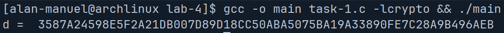

# Fundamentals of Cryptography and Network Security | Lab 4

Name: Alan Manuel Loreto Cornídez

Date: March 24th, 2024 

Due Date: April 1st, 2024

## Task 1 | Deriving the Private Key 

Deriving the key in task one uses:

$$p = F7E75FDC469067FFDC4E847C51F452DF$$

$$q = E85CED54AF57E53E092113E62F436F4F$$

$$e = 0D88C3$$

and calculates a private key, $d$

We know that $\delta= 1\mod \phi$, where $\phi = (p-1) \times (q-1)$

Here is the `C` program that lets us calculate the key using the given values.

Here is the output of the program (and our calculated $d$ value)

## Task 2 | Encrypting a Message

Here is the message that we want to encode in hex format:

![[Pasted image 20240324160925.png]]

It was produced using the following python script: 

![[Pasted image 20240324160952.png]]

This is the program that I used to calculate the ciphertext and plaintext:

![[Pasted image 20240324161738.png]]

Here is the output of the program that I used to encrypt the message (note that the ):

![[Pasted image 20240324161554.png]]

## Task 3 | Decrypting A Message 

Here is the program I wrote to decrypt the ciphertex:
![[Pasted image 20240324163352.png]]

Here is the conversion to an ascii string using the python program:
![[Pasted image 20240324163414.png]]

Here is the output of the two programs:

![[Pasted image 20240324163328.png]]

## Task 4 | Signing A Message 

This task requires the user to sign a message using the following formula:

$$s = m^{d} \mod{n}$$

First, we get the message in hex encoding:

Using the following script:

![[Pasted image 20240324171904.png]]

We can get the following output:

![[Pasted image 20240324171922.png]]

I wrote the following c program:

![[Pasted image 20240324181824.png]]

When signing the message we get the following output: 

![[Pasted image 20240324181835.png]]

Now, using the second message: 

![[Pasted image 20240324181926.png]]

We can see that although the original message only changed by one character, the entire signature is completely different.

## Task 5 | Verifying a Signature 

We can verify a signature using the following formula:

$$m = s^{e} \mod{n}$$

First, I represent the message in hex mode using the python program:

![[Pasted image 20240324183610.png]]

and get the following output:

![[Pasted image 20240324183625.png]]

Then I modify the `C` program to print the original message (assuming the signature received is correct):

![[Pasted image 20240324183731.png]]

I run the program and verify that the messages do indeed match:

 ![[Pasted image 20240324183544.png]]

Modifying the last byte to 3F instead of 2F:

![[Pasted image 20240324183841.png]]

Gives the following original message:

![[Pasted image 20240324183903.png]]

If the signature is corrupted with even one bit of changes, then the message cannot be verified. This is both good and bad, it is good because it makes sure that the scheme remains more secure/unpredictable, however, it is bad because if one bit is tampered, then the entire message is invalidated, this tradeoff between speed and accuracy during transmission is dependent on the application.

## Task 6 | Manually Verifying an X.509 Certificate

### Step 1 | Download a certificate from a real web server. 

I downloaded the certificate from youtube.com:
The first one:

![[Pasted image 20240324191257.png]]

The second one:

![[Pasted image 20240324191242.png]]

### Step 2 | Extract the public key(e, n) from issuer's certificate 

I got the modulus by using the command given in the lab sheet:

![[Pasted image 20240324191113.png]]

I got the exponent by using the command given in the lab sheet:

![[Pasted image 20240324191141.png]]

### Step 3 | Extract the signature from the server's certificate 

This command generates the file containing the signature:

![[Pasted image 20240324204223.png]]

Here is the signature:
![[Pasted image 20240324204243.png]]

I put that in a file and then removed the extraneous characters:

![[Pasted image 20240324204520.png]]

I used this command to generate the signature:

![[Pasted image 20240324204507.png]]

### Step 4 | Extract the body of the server's certificate 

I got the contents of the signature by looking at the contents the openssl command: 

![[Pasted image 20240324202226.png]]

then extracting the signature using `tr` to remove the spaces and the colons.

![[Pasted image 20240324202127.png]]

### Step 5 | Verify The Signature

I then modified the code from task 5 to verify the signature.

I got the signature generated by the certificate:

![[Pasted image 20240324204856.png]]

And then I got the hash from the signature:

![[Pasted image 20240324204834.png]]

Editting the program to verify the signature:

