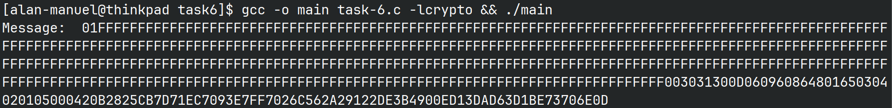

\newpage
\thispagestyle{empty} \clearpage \tableofcontents \pagenumbering{roman}
\clearpage \pagenumbering{arabic} \setcounter{page}{1}


## Task 1 | Deriving the Private Key

Deriving the key in task one uses:

$$p = F7E75FDC469067FFDC4E847C51F452DF$$

$$q = E85CED54AF57E53E092113E62F436F4F$$

$$e = 0D88C3$$

and calculates a private key, $d$

We know that $\delta= 1\mod \phi$, where $\phi = (p-1) \times (q-1)$

Here is the `C` program that lets us calculate the key using the given values.


Here is the output of the program (and our calculated $d$ value)


## Task 2 | Encrypting a Message

Here is the message that we want to encode in hex format:


It was produced using the following python script:


This is the program that I used to calculate the ciphertext and plaintext:


Here is the output of the program that I used to encrypt the message (note that
the ):


## Task 3 | Decrypting A Message

Here is the program I wrote to decrypt the ciphertex: 


Here is the conversion to an ascii string using the python program:


Here is the output of the two programs:


## Task 4 | Signing A Message

This task requires the user to sign a message using the following formula:

$$s = m^{d} \mod{n}$$

First, we get the message in hex encoding:

Using the following script:


We can get the following output:


I wrote the following c program:


When signing the message we get the following output:


Now, using the second message:


We can see that although the original message only changed by one character, the
entire signature is completely different.

## Task 5 | Verifying a Signature

We can verify a signature using the following formula:

$$m = s^{e} \mod{n}$$

First, I represent the message in hex mode using the python program:


and get the following output:


Then I modify the `C` program to print the original message (assuming the
signature received is correct):


I run the program and verify that the messages do indeed match:

[](./attachments/[Pasted image 20240324183544.png)

Modifying the last byte to 3F instead of 2F:


Gives the following original message:


If the signature is corrupted with even one bit of changes, then the message
cannot be verified. This is both good and bad, it is good because it makes sure
that the scheme remains more secure/unpredictable, however, it is bad because if
one bit is tampered, then the entire message is invalidated, this tradeoff
between speed and accuracy during transmission is dependent on the application.

## Task 6 | Manually Verifying an X.509 Certificate

### Step 1 | Download a certificate from a real web server.

I downloaded the certificate from www.example.com:443

The first certificate:

```bash
-----BEGIN CERTIFICATE-----
MIIHbjCCBlagAwIBAgIQB1vO8waJyK3fE+Ua9K/hhzANBgkqhkiG9w0BAQsFADBZ
MQswCQYDVQQGEwJVUzEVMBMGA1UEChMMRGlnaUNlcnQgSW5jMTMwMQYDVQQDEypE
................................................................
................................................................
................................................................
LGKauxCM/zRIcGa3bXLDafk5S2g5Vr2hs230d/NGW1wZrE+zdGuMxfGJzJP+DAFv
iBfcQnFg4+1zMEKcqS87oniOyG+60RMM0MdejBD7AS43m9us96Gsun/4kufLQUTI
FfnzxLutUV++3seshgefQOy5C/ayi8y1VTNmujPCxPCi6Q==
-----END CERTIFICATE-----
```

The second certificate:

```bash
-----BEGIN CERTIFICATE-----
MIIEyDCCA7CgAwIBAgIQDPW9BitWAvR6uFAsI8zwZjANBgkqhkiG9w0BAQsFADBh
MQswCQYDVQQGEwJVUzEVMBMGA1UEChMMRGlnaUNlcnQgSW5jMRkwFwYDVQQLExB3
................................................................
................................................................
................................................................
chDYABPPTHPbqjc1qCmBaZx2vN4Ye5DUys/vZwP9BFohFrH/6j/f3IL16/RZkiMN
JCqVJUzKoZHm1Lesh3Sz8W2jmdv51b2EQJ8HmA==
-----END CERTIFICATE-----
```

### Step 2 | Extract the public key(e, n) from issuer's certificate

I got the modulus by using the following command:

```bash
openssl x509 -in c1.pem -noout -modulus
```

Here is the output:

```bash
Modulus=CCF7106...
```

I got the exponent by using the following command:

```bash
openssl x509 -in c1.pem -text -noout | grep -i "exponent"
```

Here is the output:

```bash
Exponent: 65537 (0x10001)
```

### Step 3 | Extract the signature from the server's certificate

I extracted the signature using the following command:

```bash
openssl x509 -in c0.pem -text -noout
```

Which had this output:

```bash
...
...
    Signature Algorithm: sha256WithRSAEncryption
    Signature Value:
        04:e1:6e:02:3e:0d:e3:23:46:f4:e3:96:35:05:93:35:22:02:
        0b:84:5d:e2:73:86:d4:74:4f:fc:1b:27:af:3e:ca:ad:c3:ce:
        46:d6:fa:0f:e2:71:f9:0d:1a:9a:13:b7:d5:08:48:bd:50:58:
        b3:5e:20:63:86:29:ca:3e:cc:cc:78:26:e1:59:8f:5d:ca:8b:
        bc:49:31:6f:61:bd:42:ff:61:62:e1:22:35:24:26:9b:57:eb:
        e5:00:0d:ff:40:33:6c:46:c2:33:77:08:98:b2:7a:f6:43:f9:
        6d:48:df:bf:fe:fa:28:1e:7b:8a:cf:2d:61:ff:6c:87:98:a4:
        2c:62:9a:bb:10:8c:ff:34:48:70:66:b7:6d:72:c3:69:f9:39:
        4b:68:39:56:bd:a1:b3:6d:f4:77:f3:46:5b:5c:19:ac:4f:b3:
        74:6b:8c:c5:f1:89:cc:93:fe:0c:01:6f:88:17:dc:42:71:60:
        e3:ed:73:30:42:9c:a9:2f:3b:a2:78:8e:c8:6f:ba:d1:13:0c:
        d0:c7:5e:8c:10:fb:01:2e:37:9b:db:ac:f7:a1:ac:ba:7f:f8:
        92:e7:cb:41:44:c8:15:f9:f3:c4:bb:ad:51:5f:be:de:c7:ac:
        86:07:9f:40:ec:b9:0b:f6:b2:8b:cc:b5:55:33:66:ba:33:c2:
        c4:f0:a2:e9
```

I placed the signature into a file and ran the following command to clean up the
signature:

```bash
cat signature | tr -d '[:space:]:' > clean-signature
```

This is the result of the file `clean-signature`:

```bash
04e16e023e0d...
```

### Step 4 | Extract the body of the server's certificate

Then I extract the body of the server's certificate using the following command:

```bash
openssl asn1parse -i -in c0.pem -strparse 4 -out c0_body.bin -noout
```

Then I generate a hash from the body using the following command:

```bash
sha256sum c0_body.bin
```

Which has this output:

```bash
b2825cb7d71ec7093e7ff7026c562a29122de3b4900ed13dad63d1be73706e0d  c0_body.bin
```

### Step 5 | Verify The Signature

I can then verify the signature by placing the correct values into the `c` code:

```c
  // used for temporary variables.
  BN_CTX *ctx = BN_CTX_new();

  // Variables
  BIGNUM *s = BN_new(); // signature
  BIGNUM *e = BN_new(); // exponent
  BIGNUM *n = BN_new(); // modulus
  BIGNUM *M = BN_new(); // message

  // initialize variables.
  BN_hex2bn(&s, "04e.....");
  BN_hex2bn(&e, "10001");
  BN_hex2bn(&n, "CCF....");

  BN_mod_exp(M, s, e, n, ctx);
  printBN("Message: ", M);
```

Building and running the code then generates the following output:

```bash
Message:  01FFFFFF....FFFFFF003031.......00ED13DAD63D1BE73706E0D
```

This is a complete screenshot of the output:



As you can see, the hash and the message from the c program end in the same
number. This lets us know that the certificates provided by example.com are
valid certificates.


